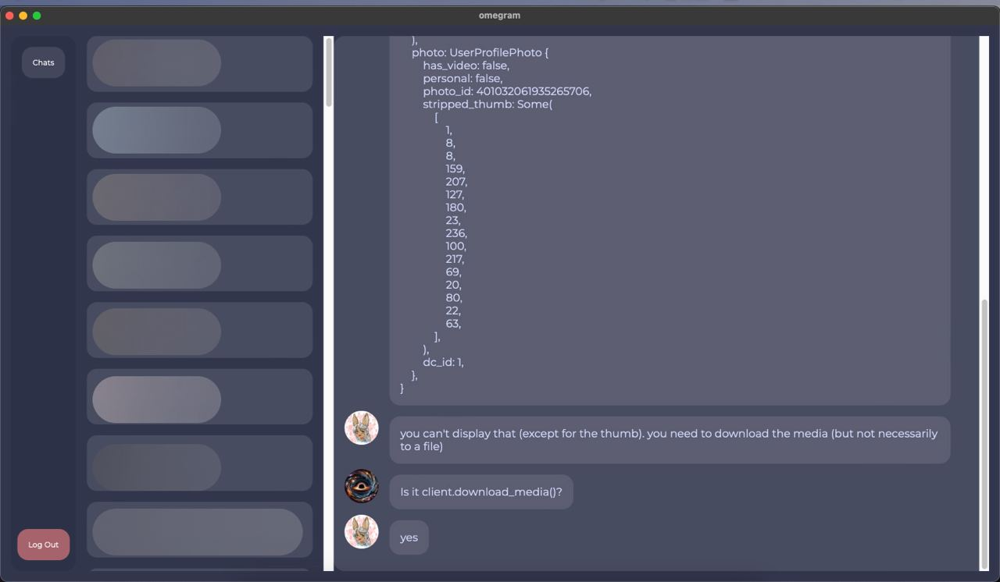

<h1 align="center">Ω Omegram</h1>

Omegram is a telegram GUI client written in rust.

## Known problems
- Low perfomance
- Problems with logging out and logging in back

## To-do
- ~~Chats~~
- ~~Messages~~
- Sending messages
- Photos
- Videos
- Sending photos
- Sending videos
- Logging in with qr-code
- Edit message
- Reactions
- Markdown
- Code highlight
- Settings

# Screenshots

# Credits
- Language: [Rust](https://rust-lang.org/)

- UI: [Tauri](https://tauri.app/)

- Telegram API: [Gramme-rs](https://gramme.rs/)