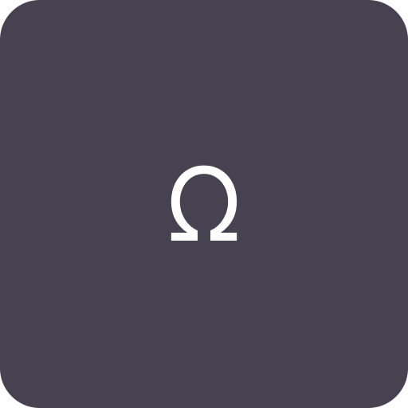
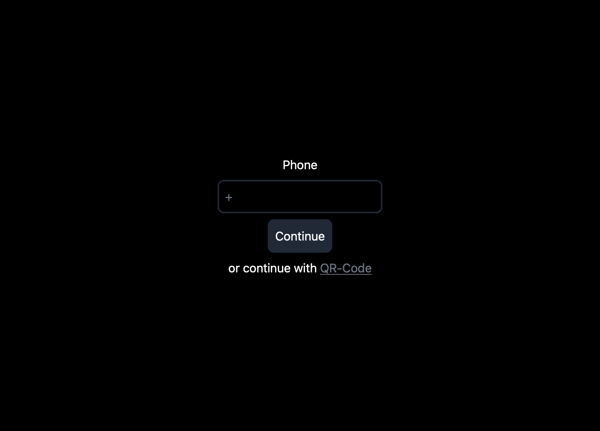
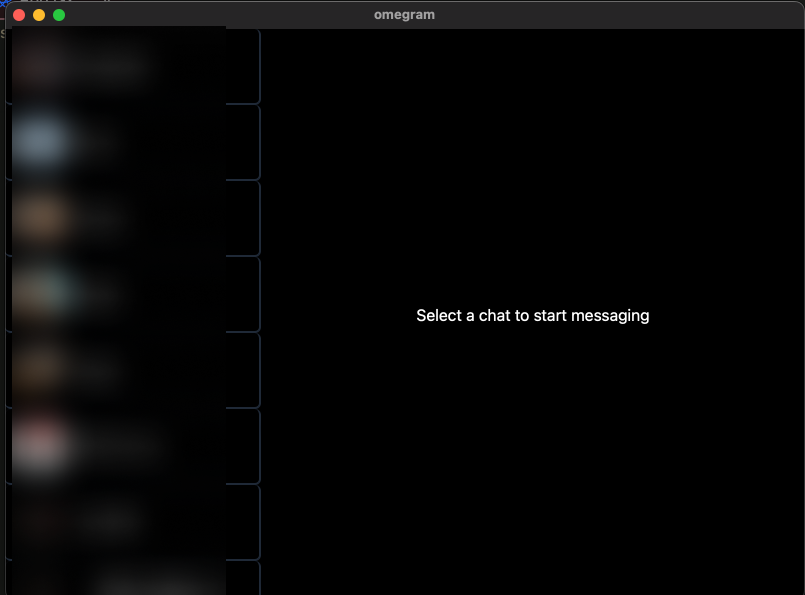

<h1 align="center">Ω Omegram</h1>

Omegram is a telegram GUI client written in rust

## Known problems
- Low perfomance
- Problems with logging out and logging in back

## Todo
- ~~Chats~~
- ~~Messages~~
- ~~Sqlite database~~
- ~~Pagination of messages~~
- ~~Caching chat history~~
- ~~Sending messages~~ implemented but SUPER bad, needs improvement
- Photos
- Videos
- Sending photos
- Sending videos
- ~~Logging in with qr-code~~
- Edit message
- Reactions
- Markdown
- Code highlight
- Settings

## Screenshots

# Credits
- Language: [Rust](https://rust-lang.org/)

- UI: [Tauri](https://tauri.app/)

- Telegram API: [Gramme-rs](https://gramme.rs/)